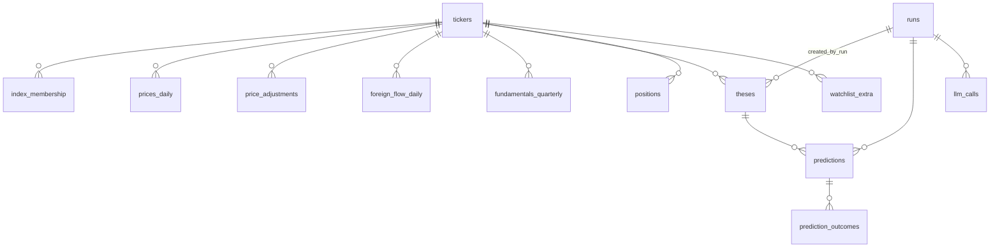
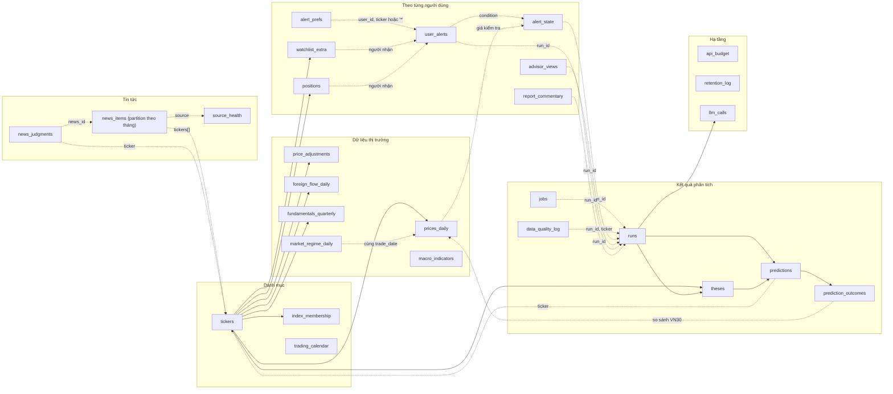

# Thiết kế database

PostgreSQL 16, database `vnmcp`. Schema nằm hoàn toàn trong `db/migrations/001`–`025` (áp bằng `db/migrate.py`). File này tóm tắt trạng thái **sau khi áp hết migration**; khi thêm migration, cập nhật lại file này.

## 1. Nguyên tắc thiết kế

- **Một nguồn sự thật cho dữ liệu thị trường:** giá, khối ngoại, BCTC, sự kiện, tin tức nằm trong DB; báo cáo được render từ DB theo yêu cầu, không cache văn bản báo cáo (`report_cache` đã bị xóa ở `012`).
- **Idempotent:** ghi lại cùng một dữ liệu không tạo bản trùng (khóa chính tự nhiên, `ON CONFLICT`).
- **Có truy vết:** mọi dòng dữ liệu ngoài có `source` + `fetched_at`; mọi kết luận có `run_id` và `config_hash`.
- **Không xóa khi vận hành:** `pipeline_rw` không có `DELETE`. "Bỏ theo dõi", "bật lại cảnh báo" đổi cột `status`/`enabled`. Chỉ `retention_job` được xóa, và ghi lại vào `retention_log`.
- **Mỗi người dùng một dữ liệu riêng:** vị thế, watchlist, cảnh báo, nhận định đều có khóa theo `user_id` (`declared_by` / `added_by`). Dữ liệu thị trường và nhãn chính thức dùng chung.
- **Không lưu secret:** token bot không nằm trong DB.

## 2. Phân quyền (`db/setup_roles.py`)

| Role | Quyền | Dùng bởi |
|---|---|---|
| `vnmcp_admin` (`DATABASE_URL`) | Toàn quyền, tạo bảng | Migration, container `scheduler` |
| `mcp_ro` | `SELECT` mọi bảng | MCP server (đọc) |
| `pipeline_rw` | `SELECT, INSERT, UPDATE` + dùng sequence, **không `DELETE`** | Worker, scheduler, các tool ghi |
| `retention_job` | `SELECT, DELETE` + `INSERT` vào `retention_log` | Job dọn dữ liệu cũ |

Sau mỗi migration thêm bảng, chạy lại `python -m db.setup_roles` để cấp quyền cho bảng mới.

## 3. Sơ đồ quan hệ

Các bảng còn lại cố ý **không có khóa ngoại** (xem mục 5).

### Luồng kết nối giữa các bảng

Nét liền = khóa ngoại thật trong DB. Nét đứt = liên kết logic qua cột cùng giá trị (`ticker`, `run_id`, `user_id`, `news_id`) nhưng **không có ràng buộc**.

Đọc nhanh:

- **`tickers` là gốc** của mọi dữ liệu thị trường và của luận điểm, vị thế, watchlist.
- **`runs` là gốc của kết quả phân tích**: `theses`, `predictions`, `llm_calls` trỏ về nó; các bảng cảnh báo và advisor tham chiếu `run_id` của nhận định chính thức.
- **Chuỗi chấm điểm:** `runs → theses → predictions → prediction_outcomes`, kết quả được tính từ `prices_daily`.
- **Chuỗi cảnh báo giá** (`pipeline/price_alerts.py`): mốc vùng vào/stop/mục tiêu lấy từ `snapshot_ref` của run `scheduled_post` mới nhất trong `runs`; giá lấy từ `prices_daily`; `alert_state` nhớ đã chạm chưa; `user_alerts` tạo một dòng cho mỗi người đang theo dõi (`watchlist_extra`) hoặc đang giữ (`positions`) mã đó, sau khi lọc bằng `alert_prefs`.
- **Tin tức** tách khỏi `tickers` bằng mảng `tickers[]` và bị drop theo tháng, nên `news_judgments` chỉ liên kết logic.

## 4. Các nhóm bảng

### 4.1 Danh mục và lịch (`001`)

| Bảng | Khóa chính | Nội dung |
|---|---|---|
| `tickers` | `ticker` | Mã, tên, sàn, `sector` (ICB), `industry_group` (nhóm dùng để so sánh ngành), ngày niêm yết/hủy niêm yết. Chỉ VN30 được seed; mã khác tự đăng ký khi được hỏi (`pipeline/coverage.py`) |
| `index_membership` | `(index_code, ticker, valid_from)` | Thành viên chỉ số theo thời gian (`valid_to` NULL = còn hiệu lực). Quyết định mã thuộc tier A (VN30) hay B |
| `trading_calendar` | `trade_date` | Ngày giao dịch / nghỉ |

### 4.2 Dữ liệu thị trường (`002`, `010`, `014`, `019`)

| Bảng | Khóa chính | Nội dung |
|---|---|---|
| `prices_daily` | `(ticker, trade_date)` | OHLCV theo VND (đã chuẩn hóa đơn vị), `value` = giá trị khớp |
| `price_adjustments` | `(ticker, ex_date, kind)` | Hệ số điều chỉnh giá (cổ tức, tách cổ phiếu) |
| `foreign_flow_daily` | `(ticker, trade_date)` | Mua/bán/ròng khối ngoại, room còn lại |
| `fundamentals_quarterly` | `(ticker, period, report_type, version)` | Chỉ số BCTC dạng `metrics JSONB`; `version` giữ các lần BCTC được điều chỉnh |
| `market_regime_daily` | `trade_date` | VN-Index: MA20/50/200, RSI14, `trend`, `regime` (`risk_on`/`risk_off`), độ rộng VN30 (`advancers`, `decliners`, `pct_above_ma50`, `liquidity_ratio`) |
| `macro_indicators` | `(indicator, period, source)` | Chuỗi vĩ mô chính thức (tỷ giá trung tâm, lãi suất liên ngân hàng, lãi tái cấp vốn) từ SBV; tải lại cùng kỳ thì ghi đè |

### 4.3 Tin tức (`009`, `018`, `021`)

| Bảng | Khóa chính | Nội dung |
|---|---|---|
| `news_items` | `(id, published_at)` | **Phân vùng theo tháng** (`PARTITION BY RANGE (published_at)`), xóa tin cũ bằng DETACH/DROP partition thay vì DELETE hàng loạt. Cột `stream` (A vĩ mô / B doanh nghiệp), `filter_status` (`kept`/`dropped`), `filter_reason`, `pillars`. Khử trùng lặp bằng unique `(url_hash, published_at)`. Partition hiện seed đến 2026-12 và được tự gia hạn; thiếu partition thì insert lỗi |
| `source_health` | `source` | Độ mới từng nguồn tin: lần OK cuối, tin mới nhất, số lần lỗi liên tiếp, thời điểm đã cảnh báo. Im lặng không được hiểu là "không có tin" |
| `news_judgments` | `(news_id, ticker)` | Đánh giá tốt/trung tính/xấu (`sentiment` -1/0/1) một tin cho một mã, do LLM của chat quyết định. Người đầu tiên thắng (`ON CONFLICT DO NOTHING`) để mọi người thấy cùng điểm. Chỉ ảnh hưởng điểm tham khảo, không đổi nhãn chính thức |

### 4.4 Kết quả phân tích (`003`, `005`, `006`)

| Bảng | Khóa chính | Nội dung |
|---|---|---|
| `runs` | `run_id` | Mỗi lần phân tích: mã, phong cách, độ sâu, `as_of`, `snapshot_ref`, `report_md`, cảnh báo, `config_hash` |
| `theses` | `id` | Luận điểm đầu tư theo phiên bản (`pillars`, `invalidation_rules`, `status`, `valid_from`/`valid_to`) |
| `predictions` | `id` | Nhận định có nhãn hành động, vùng vào lệnh (`entry_zone NUMRANGE`), `stop_loss`, `target`, `horizon_days`, `confidence`. Unique index `one_open_prediction (ticker, action_label, COALESCE(thesis_id,0)) WHERE status='open'`: mỗi tổ hợp chỉ có một nhận định đang mở |
| `prediction_outcomes` | `(prediction_id, horizon_days)` | Kết quả chấm theo từng chân trời: có khớp lệnh không, giá vào, lý do thoát, `ret`, `excess_vs_vn30` |
| `jobs` | `id` | Hàng đợi: `job_key` unique để khử trùng lặp (`on_demand:HPG:<ms>`, `scheduled_post:<ngày>`), `status` `queued → running → done/failed/expired`, `attempts`, `run_id` khi xong. Index `(status, created_at)` |
| `data_quality_log` | `id` | Kết quả từng kiểm tra chất lượng dữ liệu, `detail JSONB` |

### 4.5 Người dùng (`004`, `015`, `016`, `017`, `020`, `022`)

| Bảng | Khóa chính | Nội dung |
|---|---|---|
| `positions` | `(ticker, declared_by)` | Vị thế mỗi người. `status` `holding`/`none`: phân biệt "đã khai báo không giữ" (`/khonggiu`) với "chưa khai báo" (không có dòng) |
| `watchlist_extra` | `(ticker, added_by)` | Danh mục theo dõi mỗi người; bỏ theo dõi = `status='inactive'` |
| `alert_state` | `(ticker, condition, kind)` | Trạng thái kích hoạt theo cạnh: giá đã nằm trong vùng thì chỉ báo một lần. `condition` `entry_zone`/`stop_loss`/`target`; `kind` `touched` (giá trong phiên) / `confirmed` (giá đóng cửa). `run_id` mới thì khởi tạo lại |
| `user_alerts` | `id` | Một dòng cho mỗi người mỗi điều kiện đã kích hoạt; `delivered_at` NULL = chưa gửi (partial index `user_alerts_pending_idx`). Unique `(user_id, run_id, condition, kind, session_date)` giới hạn mỗi điều kiện một cảnh báo/phiên/người |
| `alert_prefs` | `(user_id, ticker)` | Tắt/bật cảnh báo; `ticker='*'` là mọi mã, dòng theo mã ghi đè |
| `advisor_views` | `(user_id, run_id)` | Nhận định riêng của advisor (stance `buy_accumulate`/`watch`/`stay_out`/`hold`/`reduce_exit`) cạnh `code_label` của hệ thống, dùng để so sánh trên lợi suất sau này (`ops/backtest_score.py`). Cột `playbook_version` ghi phiên bản `config/advisor-playbook.md`. Không bao giờ đổi nhãn chính thức |
| `report_commentary` | `ticker` | Đoạn "Nhận định" do AI viết, dùng lại khi `fingerprint` dữ liệu không đổi |

### 4.6 Hạ tầng và vận hành (`006`, `007`, `023`)

| Bảng | Khóa chính | Nội dung |
|---|---|---|
| `api_budget` | `name` | Hạn mức yêu cầu dùng chung cho API ngoài: mỗi lời gọi vnstock đặt chỗ `next_slot` kế tiếp, nhờ đó mọi worker và MCP server cộng lại vẫn dưới giới hạn/phút của nhà cung cấp. Seed một dòng `vnstock` |
| `retention_log` | `id` | Nhật ký dọn dữ liệu: đối tượng, hành động, số dòng, `dry_run` |
| `llm_calls` | `id` | Chi phí, token, độ trễ từng lời gọi LLM. Các vai trò LLM trong pipeline hiện **tắt**, bảng giữ lại để bật sau |

## 5. Quy ước và lưu ý

- **Khóa ngoại có chủ đích bỏ qua:** `news_judgments` (tin nằm trong bảng phân vùng và bị drop theo tháng), `advisor_views` (retention có thể xóa `runs` cũ), `alert_state`, `user_alerts`, `alert_prefs`, `report_commentary`. Dòng mồ côi chỉ là dữ liệu không dùng tới.
- **Người dùng không có bảng riêng.** `users` đã bị xóa ở `017`; danh tính là chuỗi `user_id` (`VNMCP_USER_ID`) nằm ngay trong các bảng trên.
- **Giá trị liệt kê** (`status`, `kind`, `stance`...) là `TEXT`; chỉ `news_judgments.sentiment` và `advisor_views.stance` có `CHECK`. Giá trị hợp lệ của các cột khác ghi trong comment của migration.
- **Bảng đã xóa:** `report_cache` (`012`), `users` (`017`), `llm_batch_jobs`, `llm_batch_items`, `corporate_events` (`025`: không còn code dùng, đều rỗng khi xóa).
- **Migration chỉ tiến:** không có script rollback. Chạy bằng tài khoản admin, trong container `scheduler` (xem README mục 6).
- **Test** luôn chạy trên DB riêng `vnmcp_test`, không chạm DB thật.
